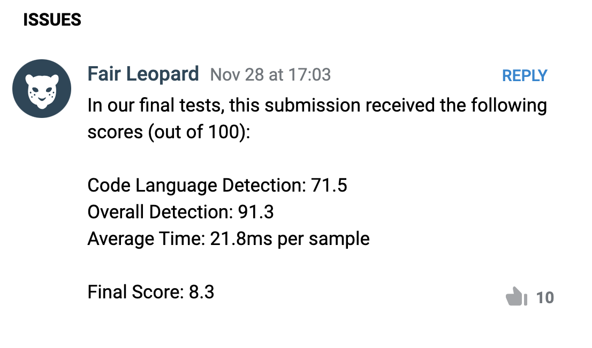

# Telegram ML Competition 2023

This project is implemented for the [ML Competition 2023](https://contest.com/docs/ML-Competition-2023-r2) which task is to create a library that detects a programming or markup language of a code snippet.

# Tglang - identify a programming language of a code snippet

This is a solution for [Telegram hackathon](https://contest.com/docs/ML-Competition-2023-r2).

The list of supported languages:
```markdown
  TGLANG_LANGUAGE_C
  TGLANG_LANGUAGE_CPLUSPLUS
  TGLANG_LANGUAGE_CSHARP
  TGLANG_LANGUAGE_CSS
  TGLANG_LANGUAGE_DART
  TGLANG_LANGUAGE_DOCKER
  TGLANG_LANGUAGE_FUNC
  TGLANG_LANGUAGE_GO
  TGLANG_LANGUAGE_HTML
  TGLANG_LANGUAGE_JAVA
  TGLANG_LANGUAGE_JAVASCRIPT
  TGLANG_LANGUAGE_JSON
  TGLANG_LANGUAGE_KOTLIN
  TGLANG_LANGUAGE_LUA
  TGLANG_LANGUAGE_NGINX
  TGLANG_LANGUAGE_OBJECTIVE_C
  TGLANG_LANGUAGE_PHP
  TGLANG_LANGUAGE_POWERSHELL
  TGLANG_LANGUAGE_PYTHON
  TGLANG_LANGUAGE_RUBY
  TGLANG_LANGUAGE_RUST
  TGLANG_LANGUAGE_SHELL
  TGLANG_LANGUAGE_SOLIDITY
  TGLANG_LANGUAGE_SQL
  TGLANG_LANGUAGE_SWIFT
  TGLANG_LANGUAGE_TL
  TGLANG_LANGUAGE_TYPESCRIPT
  TGLANG_LANGUAGE_XML
```

Other programming languages and non-code text are identified
as `TGLANG_LANGUAGE_OTHER` (index 0).

## Model development

### Data

Check out [this notebook](*)
for stats and data prep steps.

#TODO
(overview)


### Model

The prediction task can be split into two parts:

Detecting code snippets vs human language [model 1](resources/v1_code_vs_other_depth11_vocab15000.cbm).
If it is a code snippet, detecting the programming or markup language [model 2](resources/v1_languages_depth9_vocab5000.cbm).
We chose gradient boosting methods because they demonstrate better accuracy compared to classic machine learning classification methods such as Logistic Regression, SVM, Naive Bayes, Random Forest, and KNN. From the libraries that can implement gradient boosting, we selected the Catboost library due to its native support and ability to export models to the C++ language. The competition's requirements emphasize the critical importance of speed, and Catboost provides out-of-the-box support for Tokenization, IDF, and gradient boosting all-in-one."


1. Tokenizer - a simple text tokenizer is used to extract
keywords and special characters from the code. Numbers,
comments and docstrings are removed. Params:
```json
    "tokenizer_id" : "Space",
    "token_types" : ['Word', 'Number', 'Punctuation', 'SentenceBreak', 'ParagraphBreak', 'Unknown'],
    "lowercasing" : "true",
    "separator_type" : "BySense",
    "number_process_policy" : "Replace",
    "number_token" : "123",
```
2. Text embedding - a TfIdf vectorizer is used to extract
features from the train set. Params:
```json
    "dictionary_id" : "Word",
    "occurrence_lower_bound": "7",
    "max_dictionary_size": 5000,
    "gram_order" : "1",
    "dictionary_type": "Bpe"
```
3. Classifier - a catboost classifier is trained on 
vectorizer output. Params:
Params:
```json
    "tokenizers_names" : ["Space"],
    "dictionaries_names" : ["Word"],
    "feature_calcers" : ["BoW"]
```

Check out [this notebook](src/Classification-Trees-Code-VS-NoCode.ipynb)
and [this notebook](src/Classification-Trees-Code-Languages.ipynb)
for the building and exporting of the two models.


Following these steps, we import the resulting models into a C++ wrapper to meet the requirements and make predictions from C++ code.
The result of this process is a shared library named libtlang.so.

Check out [this main code](src/tglang.cpp)

### Results

- Accuracy on the test set (Code vs Other): 95% 
- Accuracy on the test set (Programming or markup language): 75%

**Result of 25/60:**


https://contest.com/ml2023-r2/entry5260

A funny moment occurred when we didn't participate in round 1 due to being an hour late for submission. This happened because we confused the time zone of Moscow with Dubai, thinking they were both GMT +3. In the rules for round 2, it was clearly stated that only participants from round 1 could submit their solutions, so we initially decided to forgo it. However, on the last day of the contest, the bot accepted our submission, prompting us to quickly update our code and submit it within a day. If we had known this earlier...


## Usage

### Build 


Go to folder "libtglang-tester-r2" and build it:
```shell
mkdir build
cd build
cmake -DCMAKE_BUILD_TYPE=Release ..
cmake --build .
```

### Run

Run on any text file:
```shell
$ ./tglang-tester <text.txt>
```

## Credits
https://github.com/dankin96
https://github.com/anatolystansler
